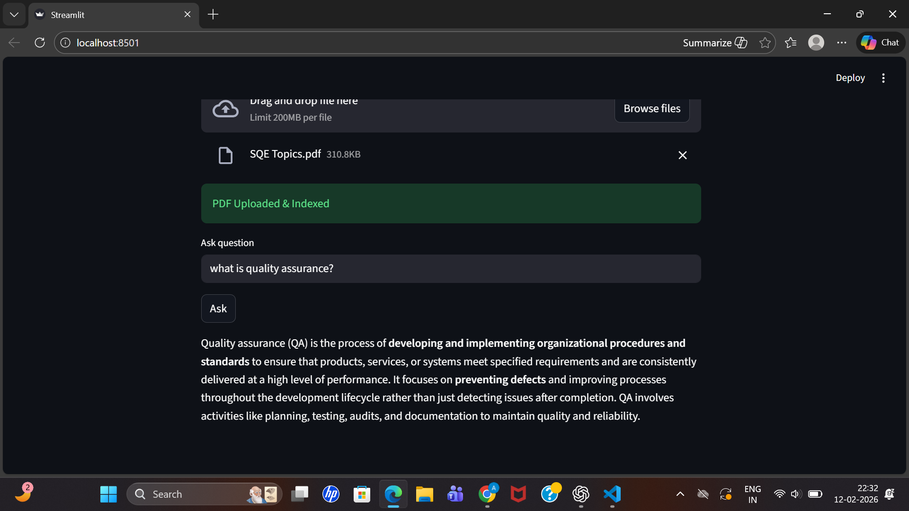
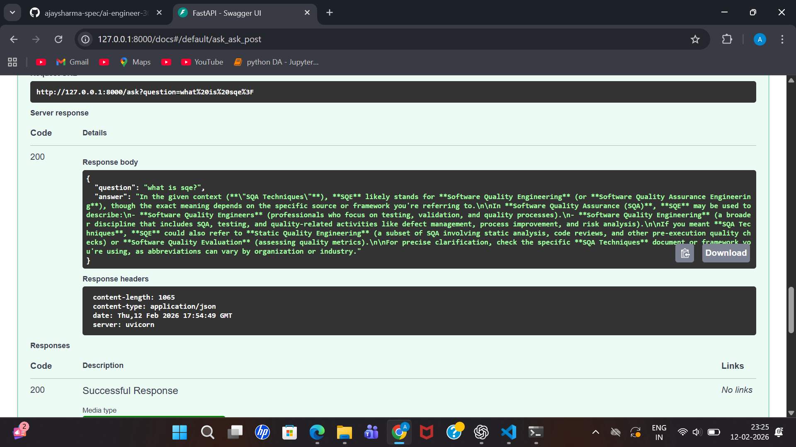

# PDF RAG Chatbot

AI-powered PDF Question Answering System using Retrieval-Augmented Generation (RAG).

---

## 🚀 Features
- Upload PDF files
- Extract text automatically
- Convert text into embeddings
- Store embeddings in ChromaDB
- Ask questions about PDF
- LLM generates contextual answers
- Simple Streamlit Chat UI

---

## 🧠 Tech Stack
- Python
- FastAPI
- Sentence Transformers
- ChromaDB
- Streamlit
- OpenRouter API

---

## ⚙️ Installation

### 1️⃣ Create Virtual Environment
python -m venv venv

### 2️⃣ Activate
venv\Scripts\activate

### 3️⃣ Install Requirements
pip install -r requirements.txt

---

## ▶️ Run Backend
uvicorn pdf_rag_api:app --reload

Open:
http://127.0.0.1:8000/docs

---

## ▶️ Run Frontend
streamlit run ui.py

Open:
http://localhost:8501

---

## 🔄 Project Workflow

PDF → Text Extraction → Embeddings → ChromaDB → LLM → Answer

---
## 📸 Project Screenshots

### 🖥 Streamlit Chat UI


### 📑 Swagger API Docs


## 🔮 Future Improvements
- Multiple PDF upload
- User authentication
- Cloud deployment
- Better chunking

# 📄 PDF RAG System (FastAPI + ChromaDB)

A production-ready Retrieval-Augmented Generation (RAG) system built using FastAPI, SentenceTransformers, and ChromaDB.

This system allows users to upload PDF documents and ask questions based on the document content.

---

## 🚀 Features

- PDF Upload
- Automatic Text Chunking
- Embedding Generation (SentenceTransformers)
- Vector Search (ChromaDB)
- Metadata-aware Retrieval (filename + chunk_id)
- FastAPI Backend
- Swagger API Testing

---

## 🧠 Architecture

PDF → Chunk → Embed → Store (ChromaDB)  
Question → Embed → Similarity Search → Retrieve → Answer

---

## 🛠 Tech Stack

- FastAPI
- SentenceTransformers (all-MiniLM-L6-v2)
- ChromaDB (Vector Database)
- PyPDF
- Uvicorn

---


## 📦 Installation

```bash
pip install fastapi uvicorn chromadb sentence-transformers pypdf
```
## 📄 Resume Analyzer API

- Cosine similarity based resume-job match
- Match percentage + level
- Skill extraction
- Missing skill detection
- FastAPI backend

## AI Resume Analyzer

An AI-powered Resume Analyzer built with FastAPI and SentenceTransformers.

This system analyzes a resume against a job description and provides:

- Resume-job match percentage
- Skill extraction
- Missing skill detection
- AI-powered resume improvement suggestions

### Tech Stack

- Python
- FastAPI
- SentenceTransformers
- NumPy
- PyPDF
- OpenRouter LLM API

### How It Works

Resume PDF  
↓  
Text Extraction  
↓  
Embedding Generation  
↓  
Cosine Similarity Calculation  
↓  
Skill Detection  
↓  
Missing Skills Analysis  
↓  
AI Feedback Generation

## 📸 Project Screenshots

### 🖥 Streamlit Chat UI


### 📑 Swagger API Docs


## 👨‍💻 Author
Ajay Sharma
